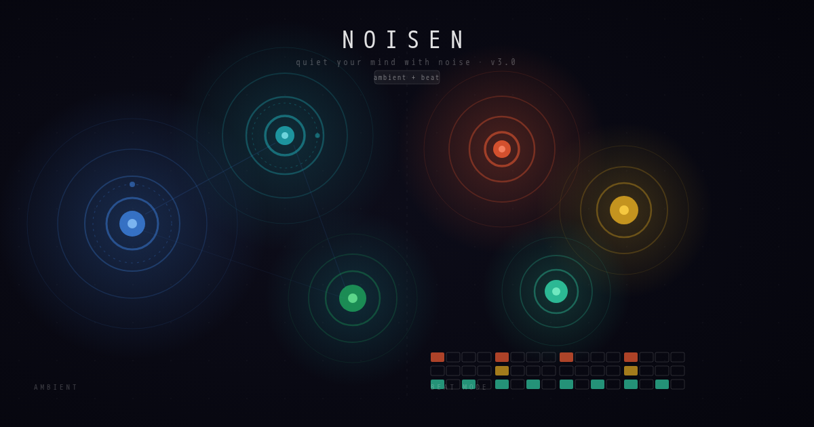

# Noisen

Quiet your mind with noise.

A minimal PWA for meditative sound generation. Place nodes on an infinite canvas — each node synthesizes sound based on its position. Two modes: **Ambient** (continuous synthesis, generative drones) and **Beat** (BPM-locked drum sequencer with 16-step patterns). Nodes gravitationally cluster, bending texture into living sound.

**Live:** [noisen.space](https://noisen.space) · No accounts. No distractions. Just sound.



---

## How it works

- **X axis** → frequency (8 Hz … ~40 kHz, logarithmic; fixed regardless of screen size or zoom)
- **Y axis** → filter cutoff (bottom = dark/filtered, top = bright/open)
- **X position** → stereo pan (left edge = −1, right edge = +1)
- **Node size** → volume (larger = louder)
- **Gravity** → nearby nodes pull each other; strength adjustable globally
- **Wave rings** → expand proportionally to frequency; speed driven by filter and node phase

---

## Modes

### Ambient mode (default)

Continuous synthesis — nodes play as long as the app is running.

| Type | Character |
|---|---|
| Sine | Pure tone, single frequency |
| Triangle | Soft, hollow, weak overtones |
| Square | Buzzy, hollow, odd harmonics |
| Sawtooth | Bright, rich, full harmonic series |
| Noise | Pink / white / brown textural bed |

Each node has: volume, pan, ADSR envelope, filter cutoff, detune/vibrato/voices (type-dependent), node delay, reverb/delay bus send, and up to 3 orbit LFOs.

### Beat mode (♩ button)

BPM-locked drum sequencer. Activating beat mode reveals a BPM control (40–300, step 1) and adds drum node types to the type selector.

| Type | Synthesis | Character |
|---|---|---|
| Kick | MembraneSynth | Punchy sub-bass thump |
| Snare | NoiseSynth | Crack and body |
| Hihat | MetalSynth | Closed or open metallic click |
| Clap | NoiseSynth | Transient snap |
| Perc | MetalSynth | Tuned metallic hit |

Each drum node has a **16-step sequencer grid** in its panel (1×16, or 8+8 in landscape). Sound parameters (tune, decay, tone/open) adjust the synthesis engine per hit. Drum nodes also support orbit LFOs (volume and pan targets).

---

## Controls

| Control | Action |
|---|---|
| Tap empty canvas | Add node |
| Drag node | Reposition — changes pitch + filter (ambient) or tune (beat) |
| Tap node | Open node panel |
| Drag background | Pan the workspace |
| Scroll / pinch | Zoom in/out |
| ▶ | Play / Stop |
| ⚄ | Generate random preset (adapts to current mode) |
| ♩ | Toggle Beat mode |
| Presets | Save / load / share |
| Nodes | All nodes overview |
| ? | Guide / changelog |

---

## Features

### Per-node parameters (ambient)

- **Wave type** — Sine / Triangle / Square / Sawtooth / Noise
- **Volume** — output level and visual size
- **Pan** — manual stereo position override
- **ADSR envelope** — Attack, Decay, Sustain, Release
- **Filter cutoff** — lowpass filter independent of Y position
- **Vibrato** — rate + depth (Sine / Triangle)
- **Voice stacking** — up to 5 detuned voices with spread (Square / Sawtooth)
- **Noise color** — Pink / White / Brown
- **Node delay** — local echo with Time, Feedback, Wet
- **Reverb send / Delay send** — master bus routing

### Per-node parameters (drum)

- **Volume** — loudness per hit
- **Pan** — stereo position applied just before each trigger
- **Tune** — pitch / resonance frequency (Kick, Hihat, Perc)
- **Decay** — envelope length
- **Pitch↓** — pitch fall speed (Kick only)
- **Tone** — noise color from dark to bright (Snare, Clap)
- **Open** — closed vs open hat (Hihat)

### Orbit modulation (LFO)

Each node supports up to **3 independent orbits** — sine LFOs that modulate a parameter continuously.

| Target | Ambient | Drum |
|---|---|---|
| Filter | ✓ | — |
| Pan | ✓ | ✓ |
| Volume | ✓ | ✓ |
| Delay | ✓ | — |

Controls: **Rate** (0.02–2 Hz), **Depth** (0–100%), direction (↻/↺). Visualised as dashed rings with a moving dot.

### Gravity clustering

Nodes attract each other with Gaussian falloff — strength set globally. Dragging repositions nodes; gravity resumes on release. Runs every third frame to keep the audio thread clear.

### Random presets

14 ambient archetypes + anti-repeat (never generates the same archetype twice in a row):

| Archetype | Range |
|---|---|
| Binaural beats | 80–500 Hz carriers, ±0.5–30 Hz beat |
| Solfeggio | 174–963 Hz sacred frequencies |
| Harmonic series | Natural overtone stack |
| Full spectrum | Sub · bass · mid · presence · air |
| Scale | Major / Minor / Pentatonic / Dorian / Lydian / Phrygian |
| Polyrhythm | 25 Hz–3 kHz, integer-ratio LFO rates |
| Gamelan bells | Inharmonic high intervals |
| Pentatonic pulse | 5 voices, independent breath rates |
| Fibonacci / φ | Frequencies and rates from golden ratio |
| Drone swarm | Micro-detuned unisons, 30–600 Hz |
| Deep sub | Sub-bass 14–55 Hz territory |
| Crystalline | High shimmer 1.2–18 kHz |
| Noise texture | Layered noise bands across spectrum |
| Stochastic | Fully random across all 10 octaves |

In Beat mode the random button generates drum kits (four-on-floor, breakbeat, half-time, euclidean).

### Master FX chain

- **Lo Cut / Hi Cut** — highpass and lowpass filters
- **Tone** — master lowpass color
- **Reverb** — wet + decay
- **Delay** — wet + time + feedback
- **Volume** — master output level

### Presets & sharing

Save your node configuration with a name. Share via URL — entire state encoded as compressed base64:

```
https://noisen.space/?p=<base64-encoded-preset>
```

No server. No account. Anyone who opens the link hears your setup.

### Recording

Record audio output directly to `.webm` — no plugins. Recorder button (●) in topbar.

### PWA

- Installable on iOS, Android, desktop
- Works fully offline after first visit
- Plays in silent mode (Web Audio API, no `<audio>` element)
- Responsive — portrait and landscape

---

## Stack

| Layer | Technology |
|---|---|
| Frontend | Vanilla ES modules + Vite |
| Audio | Tone.js (Web Audio API) |
| Render | Canvas 2D |
| Build | Docker + Node 20 + Vite 5 |
| CDN | BunnyCDN |
| Domain | noisen.space |

### Source structure

```
source/
  index.html              HTML shell
  styles/main.css         All styles
  javascript/
    store.js              Shared state, constants, icons, defaults
    audio.js              Tone.js engine — ambient nodes, drum synths, LFOs, master chain
    canvas.js             Rendering, hit testing, zoom/pan, ripples, orbits
    ui.js                 Panels, tabs, overlays, wizard, presets, changelog
    main.js               Entry — wires everything, preset generators, interaction
  public/
    sw.js                 Service worker (offline cache)
    manifest.json         PWA manifest
    icons/                App icons (SVG + PNG, maskable)
    marketing/            OG image (1200×630), social banner (1280×640)
```

---

## Development

### Prerequisites

Docker (no local Node or browser required).

### Build

```bash
bash infrastructure/scripts/build.sh
```

Builds `source/` → `dist/` inside a Docker container.

### Deploy

Copy `.env.local.example` → `.env.local`, fill in BunnyCDN credentials:

```bash
source .env.local
bash infrastructure/scripts/deploy-cdn.sh
```

Builds, uploads `dist/` to CDN, purges cache.

### Screenshots

```bash
bash infrastructure/scripts/compare-panels.sh   # ambient vs drum panel comparison
bash infrastructure/scripts/capture-screenshots.sh  # desktop + mobile screenshots
```

### Tests

```bash
bash infrastructure/scripts/test-recording.sh
bash infrastructure/scripts/test-font-sizes.sh
```

All run Playwright (Chromium) inside Docker.
